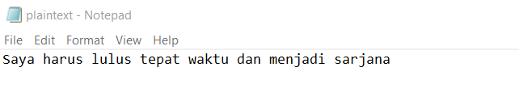
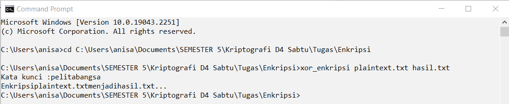
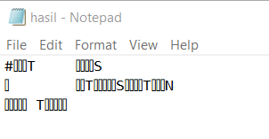

# Kripto-Tugas-15

                                      # Coding Menggunkan XOR Untuk Enkripsi

 Silakan membuat codingan Program dengan menggunakan XOR untuk Enkripsi dengan TEXT  adalah : "Saya harus lulus tepat waktu dan menjadi sarjana" dari materi  yang telah disampaikan, codingan simpan pada Repositori (Githubs aau Gitlabs) dan yang diupload di ecampus hanya link Githubs atau link Gitlabs, Terima kasih
 
 1. Plaintext
  
  
 2. CMD
  
  
 3. Hasil dari Enkripsi
   
   
   Untuk Script Codingnya Ada Di Bawah File
